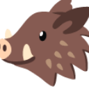

# Boar 🐗

<p align="center">
  <a href="https://github/egxn/boar">
    
  </a>
</p>

<p align="center">
  A customizable touchpad for linux using your mobile device
</p>


Some uses:

-[x] 🙂 Emojis keyboard
-[x] 📡 Streaming
-[x] 🎨 Apps Shortcuts 
-[x] 🔔 Touch midi controller

## Dependencies

This app works works linux with X.Org Server.

## Development dependencies

* Node and npm
* Rust and cargo

## Setup

``` bash
  yarn --cwd client install
  yarn --cwd client build
  cargo run
```

## How add a preset of shortcuts

Create a new file in  `/client/src/presets/`

``` json
{
  "title": "",
  "label": "",
  "keys": [
    {
      "background": "",
      "command": "",
      "label": "",
      "kind": "" // "key" or "type"
    }
  ]
}
```

## Idea

This is a Rust 🦀 server and a React ⚛️ app as GUI over your local wifi network


---

Built with Rust 🦀 TS 🔷 