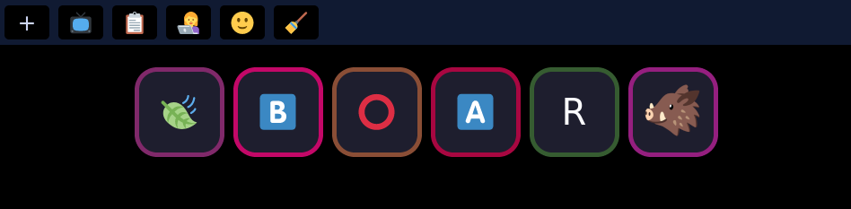
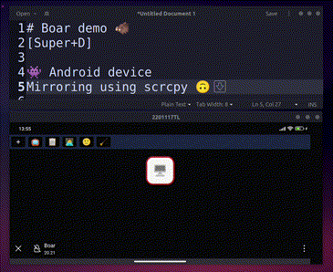

# Boar 🐗

<p align="center">
  <a href="https://github/egxn/boar">
    
  </a>
</p>

<p align="center">
  A customizable touchpad for linux 🐧 using your mobile device
</p>


## Some uses:

- [x] 🙂 Emojis keyboard
- [x] 📡 Streaming
- [x] 🎨 Apps Shortcuts 
- [x] 🔔 Touch midi controller

## Features

### Keys depending on the app 


### Keys combinations



### Text input


## Dependencies

This app works in linux with X.Org and xdotool.

## Development

### Dependencies

* Node, yarn
* Rust, cargo

### Setup

``` bash
  cargo build --release
  cargo run --release
```

## How add a preset of shortcuts

Create a new file in  `/client/src/presets/`

``` json
{
  "title": "",
  "label": "",
  "keys": [
    {
      "appTitle": "",
      "background": "",
      "command": "",
      "label": "",
      "kind": "" // "keys" or "type"
    }
  ]
}
```

---

Built with Rust 🦀 + TS 🔵
